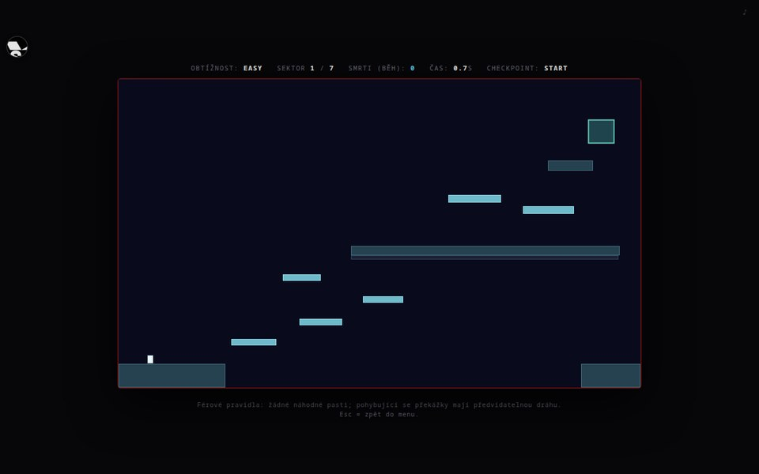
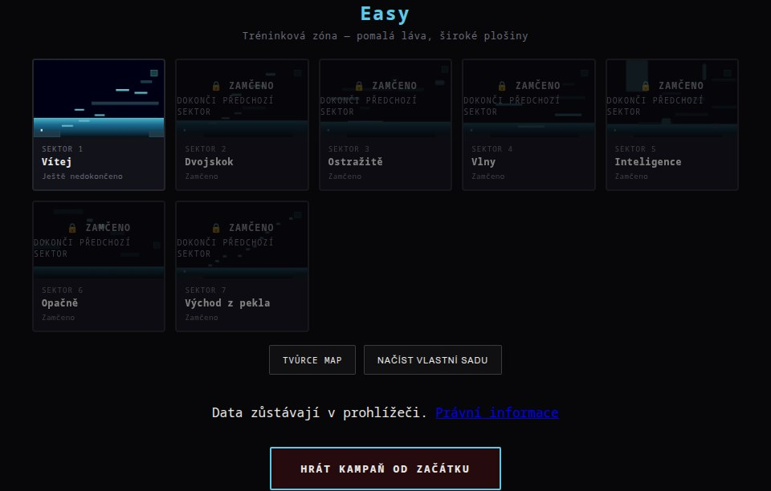
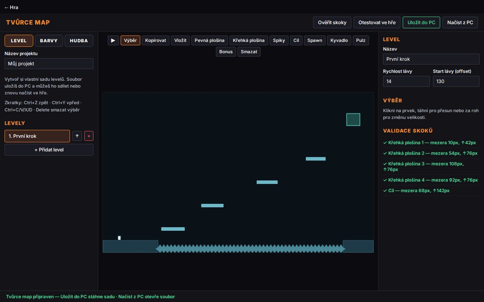

# HardCore Mode

Plošinovková hra běžící čistě v prohlížeči (vanilla JS, Canvas, Web Audio API) — bez serveru, bez odesílání dat. Obsahuje i editor map pro vlastní úrovně.

## Screenshoty

| Hra | Výběr sektorů |
|---|---|
|  |  |

| Editor map |
|---|
|  |

## Spuštění

Stačí statický webserver, např.:

```bash
node dev-server.cjs
```

a otevřít `http://localhost:8765/index.html` (hra) nebo `http://localhost:8765/editor.html` (editor map).

## Sestavení publikované verze

```bash
node build-public.cjs
```

Vygeneruje omezenou/publikovatelnou verzi do `public/` (viz `publish-config.js`).

## Licence

MIT, viz [LICENSE](LICENSE). Právní a privacy informace k publikované verzi: [PUBLIC_LEGAL.md](PUBLIC_LEGAL.md).

Autor: Časomil
